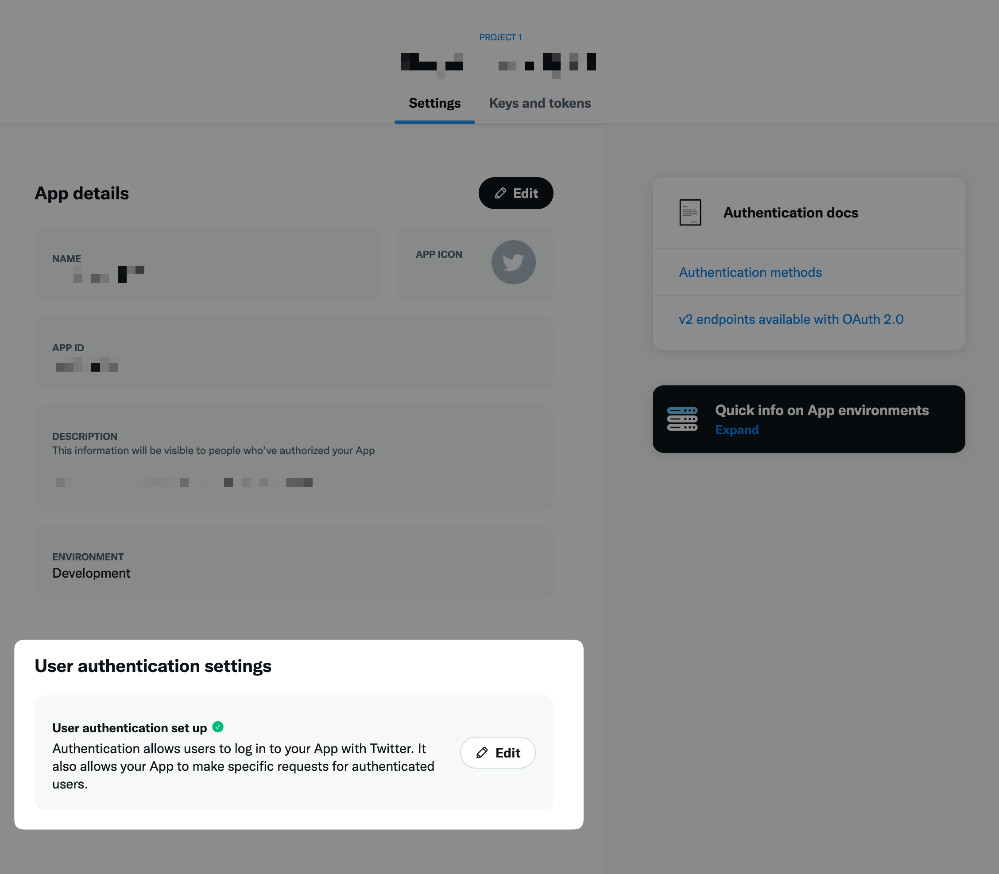
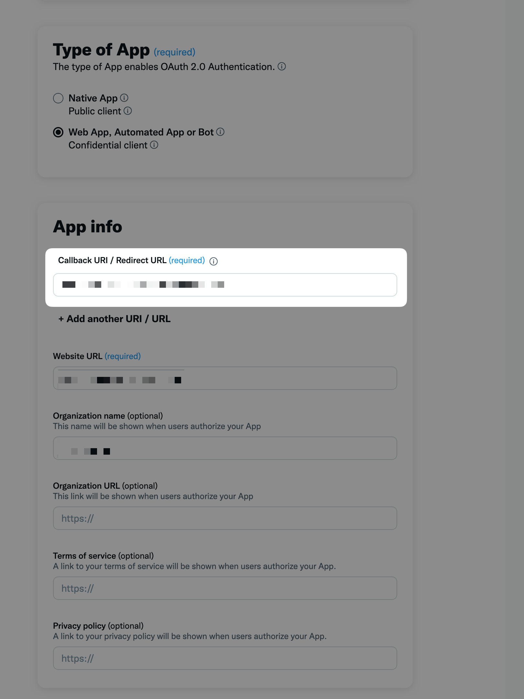
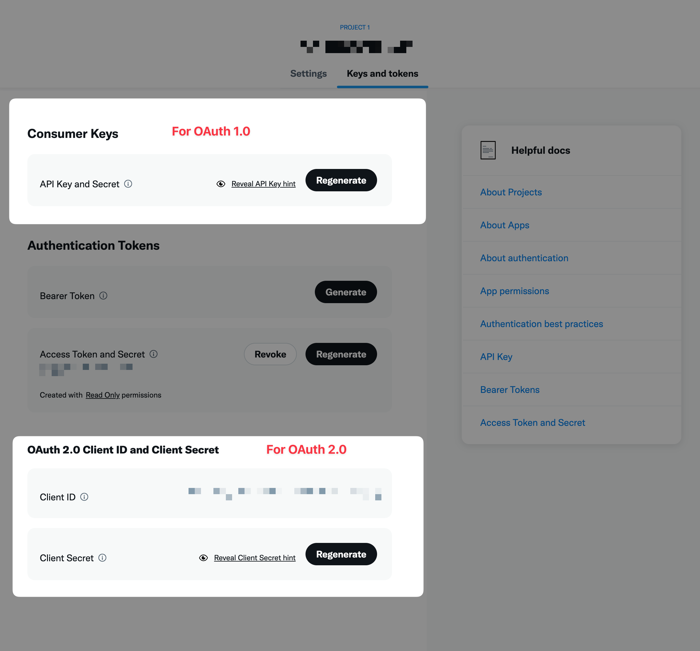

# Twitter API wiki

:::note Working with the Twitter API?
Please add your learnings, favorite links and gotchas here by [editing this page](https://github.com/nangohq/nango/tree/master/docs/docs/providers/twitter.md).

:::

## Using Twitter OAuth 1.0 with Nango

Provider template name in Nango: `twitter`  
Follow our [quickstart](../quickstart.md) to add an OAuth integration with Twitter in 5 minutes.

:::info
For Twitter's OAuth 1 flow, you should not use the "OAuth 2.0 Client ID and Client Secret" but the "Consumer Keys" instead ("API Key" and "API Key Secret").
:::

### App registration & publishing

_No information yet, feel free to contribute it (or check out [airtable](airtable.md) for an example)_

### Useful links

_No links yet, feel free to contribute it (or check out [airtable](airtable.md) for an example)_

### API specific gotchas

_No gotchas yet, feel free to contribute it (or check out [airtable](airtable.md) for an example)_

## Using Twitter OAuth 2.0 with Nango

Provider template name in Nango: `twitter-v2`  
Follow our [quickstart](../quickstart.md) to add an OAuth integration with Twitter in 5 minutes.

### App registration & publishing

- Create a new app on [Twitter's developer portal](https://developer.twitter.com/en/portal)
- Register the app's callback URL in "Settings" > "User authentication set up"

- Get your client ID and secret from "Keys and tokens" > "OAuth 2.0 Client ID and Client Secret"

### Useful links

- https://developer.twitter.com/en/docs/authentication/oauth-2-0/user-access-token

### API specific gotchas

- Twitter OAuth 2.0 uses basic auth to request a token. 