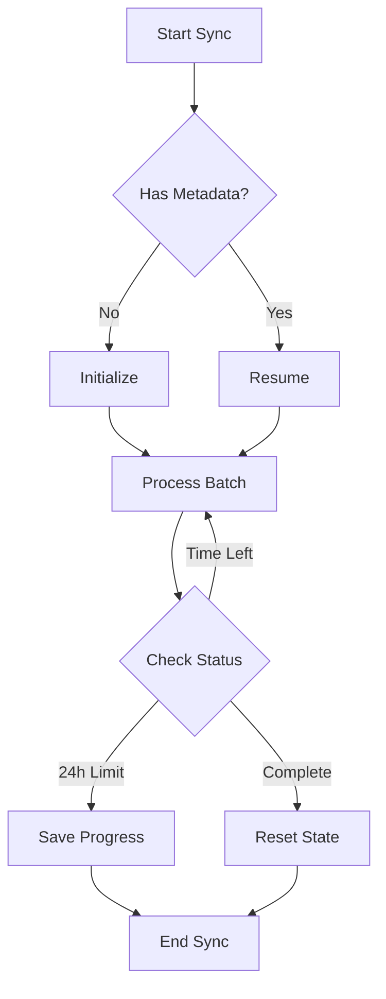

A 24-hour extended sync pattern is designed to handle large datasets that cannot be processed within a single sync run due to Nango's 24-hour script execution limit. This pattern is essential when:
- Your sync needs to process more data than can be handled within 24 hours
- You need to handle API rate limits while staying within the execution limit
- You're dealing with very large historical datasets
- You need to ensure data consistency across multiple sync runs

## Why This Pattern?

Nango enforces a 24-hour limit on script execution time for several reasons:
- To prevent runaway scripts that could impact system resources
- To ensure fair resource allocation across all integrations
- To maintain system stability and predictability
- To encourage efficient data processing patterns

When your sync might exceed this limit, you need to:
1. Break down the sync into manageable chunks
2. Track progress using metadata
3. Resume from where the last run stopped
4. Ensure data consistency across runs

## Visual Representation



## Key Characteristics

- Uses cursor-based pagination with metadata persistence
- Implements time-remaining checks
- Gracefully handles the 24-hour limit
- Maintains sync state across multiple runs
- Supports automatic resume functionality
- Ensures data consistency between runs

## Implementation Notes

This pattern uses metadata to track sync progress and implements time-aware cursor-based pagination. Here's a typical implementation:

```typescript
import { createSync } from 'nango';
import { z } from 'zod';

const SyncCursor = z.object({
    currentStartTime: z.string().optional(),
    lastProcessedId: z.string().optional(),
    totalProcessed: z.number().optional()
});

const DataRecord = z.object({
    id: z.string(),
    data: z.any()
});

const sync = createSync({
    description: '24-hour extended sync for large datasets',
    version: '1.0.0',
    frequency: 'every day',
    autoStart: true,
    syncType: 'full',

    endpoints: [
        {
            method: 'GET',
            path: '/data',
            group: 'Data'
        }
    ],

    models: {
        DataRecord: DataRecord
    },

    metadata: SyncCursor,

    exec: async (nango) => {
        const START_TIME = Date.now();
        const MAX_RUNTIME_MS = 23.5 * 60 * 60 * 1000; // 23.5 hours in milliseconds

        // Get or initialize sync metadata
        let metadata = await nango.getMetadata<z.infer<typeof SyncCursor>>();

        // Initialize sync window if first run
        if (!metadata?.currentStartTime) {
            await nango.updateMetadata({
                currentStartTime: new Date().toISOString(),
                lastProcessedId: null,
                totalProcessed: 0
            });
            metadata = await nango.getMetadata<z.infer<typeof SyncCursor>>();
        }

        let shouldContinue = true;

        while (shouldContinue) {
            // Check if we're approaching the 24h limit
            const timeElapsed = Date.now() - START_TIME;
            if (timeElapsed >= MAX_RUNTIME_MS) {
                // Save progress and exit gracefully
                await nango.log('Approaching 24h limit, saving progress and exiting');
                return;
            }

            // Fetch and process data batch
            const response = await fetchDataBatch(metadata.lastProcessedId);
            await processAndSaveData(response.data);

            // Update progress
            await nango.updateMetadata({
                lastProcessedId: response.lastId,
                totalProcessed: (metadata.totalProcessed || 0) + response.data.length
            });

            // Check if we're done
            if (response.isLastPage) {
                // Reset metadata for fresh start
                await nango.updateMetadata({
                    currentStartTime: null,
                    lastProcessedId: null,
                    totalProcessed: 0
                });
                shouldContinue = false;
            }
        }
    }
});

async function fetchDataBatch(lastId: string | null): Promise<{data: any[], lastId: string, isLastPage: boolean}> {
    const config = {
        endpoint: '/data',
        params: {
            after: lastId,
            limit: 100
        },
        retries: 10
    };

    const response = await nango.get(config);
    return {
        data: response.data.records,
        lastId: response.data.records[response.data.records.length - 1]?.id,
        isLastPage: !response.data.nextRecordsUrl
    };
}
```

## Key Implementation Aspects

- Tracks elapsed time to respect the 24-hour limit
- Maintains detailed progress metadata
- Implements cursor-based pagination
- Provides automatic resume capability
- Ensures data consistency across runs
- Handles rate limits and data volume constraints

## Best Practices

1. Leave buffer time (e.g., stop at 23.5 hours) to ensure clean exit
2. Save progress frequently
3. Use efficient batch sizes
4. Implement proper error handling
5. Log progress for monitoring
6. Test resume functionality thoroughly

## Common Pitfalls

1. Not accounting for API rate limits in time calculations
2. Insufficient progress tracking
3. Not handling edge cases in resume logic
4. Inefficient batch sizes
5. Poor error handling
6. Incomplete metadata management

<Tip>
    **Questions, problems, feedback?** Please reach out in the [Slack community](https://nango.dev/slack).
</Tip>
