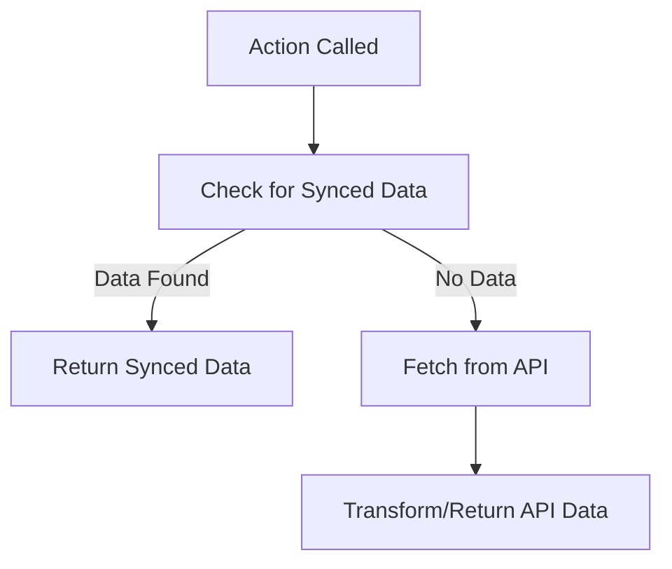

An "Action Leveraging Sync Responses" pattern allows actions to efficiently return data that has already been fetched and saved by a sync, rather than always querying the third-party API. This approach is useful when:

- The data needed by the action is already available from a previous sync
- You want to minimize API calls, reduce latency, and improve reliability
- You want to provide a fast, consistent user experience even if the third-party API is slow or unavailable

This pattern is especially valuable for actions that need to return lists of entities (e.g., users, projects, items) that are already available from a sync.

## Key Characteristics

- Uses previously fetched or synced data when available
- Falls back to a live API call only if no data is available
- Transforms data as needed before returning
- Returns a consistent, typed response

## Visual Representation



## Implementation Example

Here's a generic example of this pattern:

```typescript
import { createAction } from 'nango';
import { z } from 'zod';

const Entity = z.object({
    id: z.string(),
    name: z.string()
});

const EntityList = z.object({
    entities: z.array(Entity)
});

const action = createAction({
    description: 'Fetch all entities for an action, preferring previously synced data',
    version: '1.0.0',

    endpoint: {
        method: 'GET',
        path: '/entities',
        group: 'Entities'
    },

    input: z.void(),
    output: EntityList,

    exec: async (nango) => {
        const syncedEntities: z.infer<typeof Entity>[] = await getSyncedEntities(nango);

        if (syncedEntities.length > 0) {
            return {
                entities: syncedEntities.map(({ id, name, ...rest }) => ({
                    id,
                    name,
                    ...rest,
                })),
            };
        }

        // Fallback: fetch from API (not shown)
        return { entities: [] };
    }
});

async function getSyncedEntities(nango: any): Promise<z.infer<typeof Entity>[]> {
    // Implement logic to retrieve entities from previously synced data
    return [];
}
```

## Key Implementation Aspects

- **Synced data first:** The action first attempts to use data that was previously fetched by a sync
- **Fallback:** If no records are found, it can fallback to a live API call (not shown in this example)
- **Transformation:** The action transforms the data as needed before returning
- **Consistent Response:** Always returns a consistent, typed response, even if no data is found

## Best Practices

1. **Prefer previously synced data** to minimize API calls and improve performance
2. **Handle empty or special cases** gracefully
3. **Return a consistent response shape** regardless of data source
4. **Document fallback logic** for maintainability
5. **Keep transformation logic simple and clear**

## Common Pitfalls

1. Not keeping synced data up to date, leading to stale or missing data
2. Failing to handle the case where no data is available from sync or API
3. Returning inconsistent response shapes
4. Not transforming data as needed
5. Overcomplicating fallback logic

<Tip>
    **Questions, problems, feedback?** Please reach out in the [Slack community](https://nango.dev/slack).
</Tip>
