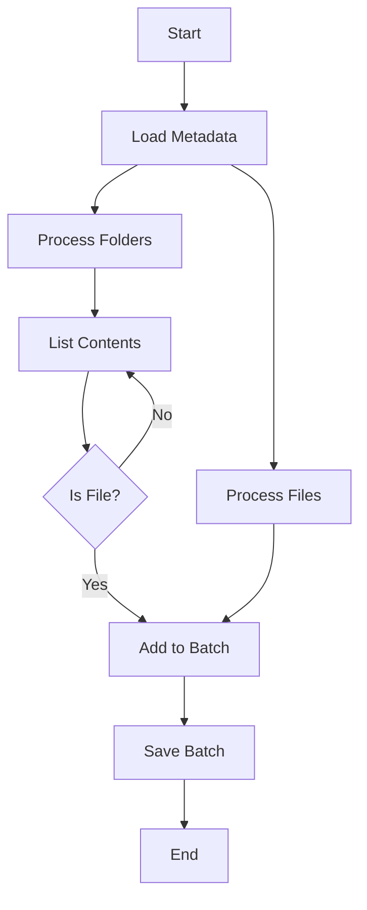

A selection-based sync pattern allows users to specify exactly which resources to sync through metadata. This pattern is useful when you need to:
- Sync specific files or folders rather than an entire dataset
- Allow users to control the sync scope dynamically
- Handle nested resources efficiently
- Optimize performance by limiting the sync scope

## Key Characteristics

- Uses metadata to define sync targets
- Supports multiple selection types (e.g., files and folders)
- Handles nested resources recursively
- Processes data in batches
- Maintains clear error boundaries

## Visual Representation



## Implementation Example

Here's how this pattern is implemented in a Box files sync:

```typescript
import { createSync } from 'nango';
import { z } from 'zod';

const BoxMetadata = z.object({
    files: z.array(z.string()),
    folders: z.array(z.string())
});

const BoxDocument = z.object({
    id: z.string(),
    name: z.string(),
    modified_at: z.string(),
    download_url: z.string().optional()
});

const sync = createSync({
    description: 'Sync files from specific folders or individual files',
    version: '1.0.0',
    frequency: 'every day',
    autoStart: false,
    syncType: 'full',

    endpoints: [
        {
            method: 'GET',
            path: '/files',
            group: 'Files'
        }
    ],

    models: {
        BoxDocument: BoxDocument
    },

    metadata: BoxMetadata,

    exec: async (nango) => {
        const metadata = await nango.getMetadata<z.infer<typeof BoxMetadata>>();
        const files = metadata?.files ?? [];
        const folders = metadata?.folders ?? [];
        const batchSize = 100;

        if (files.length === 0 && folders.length === 0) {
            throw new Error('Metadata for files or folders is required.');
        }

        // Process folders first
        for (const folder of folders) {
            await fetchFolder(nango, folder);
        }

        // Then process individual files
        let batch: z.infer<typeof BoxDocument>[] = [];
        for (const file of files) {
            const metadata = await getFileMetadata(nango, file);
            batch.push({
                id: metadata.id,
                name: metadata.name,
                modified_at: metadata.modified_at,
                download_url: metadata.shared_link?.download_url
            });
            if (batch.length >= batchSize) {
                await nango.batchSave(batch, 'BoxDocument');
                batch = [];
            }
        }
        if (batch.length > 0) {
            await nango.batchSave(batch, 'BoxDocument');
        }
    }
});

async function fetchFolder(nango: any, folderId: string) {
    const proxy = {
        endpoint: `/2.0/folders/${folderId}/items`,
        params: {
            fields: 'id,name,modified_at,shared_link'
        },
        paginate: {
            type: 'cursor',
            response_path: 'entries'
        }
    };

    let batch: z.infer<typeof BoxDocument>[] = [];
    const batchSize = 100;

    for await (const items of nango.paginate(proxy)) {
        for (const item of items) {
            if (item.type === 'folder') {
                await fetchFolder(nango, item.id);
            }
            if (item.type === 'file') {
                batch.push({
                    id: item.id,
                    name: item.name,
                    modified_at: item.modified_at,
                    download_url: item.shared_link?.download_url
                });
                if (batch.length >= batchSize) {
                    await nango.batchSave(batch, 'BoxDocument');
                    batch = [];
                }
            }
        }
    }

    if (batch.length > 0) {
        await nango.batchSave(batch, 'BoxDocument');
    }
}
```

## Best Practices

1. **Simple Metadata Structure**: Keep the selection criteria simple and clear
2. **Batch Processing**: Save data in batches for better performance
3. **Clear Resource Types**: Handle different resource types (files/folders) separately
4. **Error Boundaries**: Handle errors at the item level to prevent full sync failure
5. **Progress Logging**: Add debug logs for monitoring progress

## Common Pitfalls

1. Not validating metadata inputs
2. Missing batch size limits
3. Not handling API rate limits
4. Poor error handling for individual items
5. Missing progress tracking logs

<Tip>
    **Questions, problems, feedback?** Please reach out in the [Slack community](https://nango.dev/slack).
</Tip>
