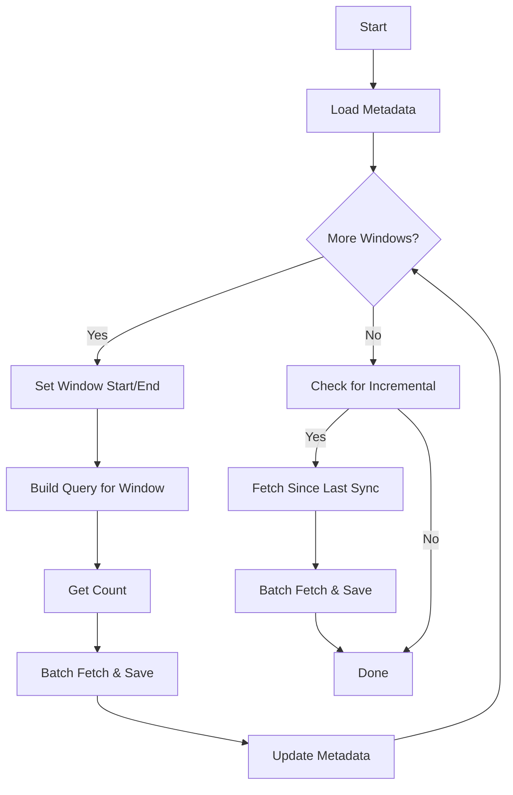

A window time based sync pattern is designed to efficiently process large datasets by breaking the sync into discrete, time-bounded windows (e.g., monthly or weekly). This approach is essential when:

- The third-party API or dataset is too large to fetch in a single request or run
- You want to avoid timeouts, memory issues, or API rate limits
- You need to ensure incremental, resumable progress across large time ranges

This pattern is especially useful for financial or transactional data, where records are naturally grouped by time periods.

## Key Characteristics

- Divides the sync into time windows (e.g., months)
- Iterates over each window, fetching and processing data in batches
- Uses metadata to track progress and allow for resumable syncs
- Handles both initial full syncs and incremental updates
- Supports batching and pagination within each window

## Visual Representation



## Implementation Example

Here's a simplified example of the window time based sync pattern, focusing on the window selection and iteration logic:

```typescript
import { createSync } from 'nango';
import { z } from 'zod';

const WindowMetadata = z.object({
    fromDate: z.string().optional(),
    toDate: z.string().optional(),
    useMetadata: z.boolean().optional()
});

const sync = createSync({
    description: 'Window time based sync for large datasets',
    version: '1.0.0',
    frequency: 'every day',
    autoStart: true,
    syncType: 'incremental',

    endpoints: [
        {
            method: 'GET',
            path: '/data',
            group: 'Data'
        }
    ],

    models: {
        DataRecord: z.object({
            id: z.string(),
            created_at: z.string(),
            data: z.any()
        })
    },

    metadata: WindowMetadata,

    exec: async (nango) => {
        // 1. Load metadata and determine the overall date range
        const metadata = await nango.getMetadata<z.infer<typeof WindowMetadata>>();
        const lookBackPeriodInYears = 5;
        const { startDate, endDate } = calculateDateRange(metadata, lookBackPeriodInYears);
        let currentStartDate = new Date(startDate);

        // 2. Iterate over each time window (e.g., month)
        while (currentStartDate < endDate) {
            let currentEndDate = new Date(currentStartDate);
            currentEndDate.setMonth(currentEndDate.getMonth() + 1);
            currentEndDate.setDate(1);

            if (currentEndDate > endDate) {
                currentEndDate = new Date(endDate);
            }

            // 3. Fetch and process data for the current window
            const data = await fetchDataForWindow(currentStartDate, currentEndDate);
            await processAndSaveData(data);

            // 4. Update metadata to track progress
            await nango.updateMetadata({
                fromDate: currentEndDate.toISOString().split("T")[0],
                toDate: endDate.toISOString().split("T")[0],
                useMetadata: currentEndDate < endDate,
            });

            currentStartDate = new Date(currentEndDate.getTime());
            if (currentStartDate >= endDate) {
                await nango.updateMetadata({
                    fromDate: endDate.toISOString().split("T")[0],
                    toDate: endDate.toISOString().split("T")[0],
                    useMetadata: false,
                });
                break;
            }
        }

        // 5. Optionally, handle incremental updates after the full windowed sync
        if (!metadata.useMetadata) {
            // ... (incremental sync logic)
        }
    }
});

async function fetchDataForWindow(start: Date, end: Date) {
    // Implement provider-specific logic to fetch data for the window
    return [];
}

async function processAndSaveData(data: any[]) {
    // Implement logic to process and save data
}
```

## Key Implementation Aspects

- **Windowing:** The sync iterates over each month (or other time window), building queries and fetching data for just that period
- **Batching:** Large result sets are fetched in batches (e.g., 100,000 records at a time) within each window
- **Metadata:** Progress is tracked in metadata, allowing the sync to resume from the last completed window if interrupted
- **Incremental:** After the full windowed sync, the script can switch to incremental mode, fetching only records modified since the last sync
- **Error Handling:** Each window and batch is processed independently, reducing the risk of a single failure stopping the entire sync

## Best Practices

1. **Choose an appropriate window size** (e.g., month, week) based on data volume and API limits
2. **Track progress in metadata** to support resumability and avoid duplicate processing
3. **Batch large queries** to avoid memory and timeout issues
4. **Log progress** for observability and debugging
5. **Handle incremental updates** after the initial full sync

## Common Pitfalls

1. Not updating metadata after each window, risking duplicate or missed data
2. Using too large a window size, leading to timeouts or API errors
3. Not handling incremental syncs after the initial windowed sync
4. Failing to batch large result sets, causing memory issues
5. Not validating or handling edge cases in date calculations

<Tip>
    **Questions, problems, feedback?** Please reach out in the [Slack community](https://nango.dev/slack).
</Tip>
