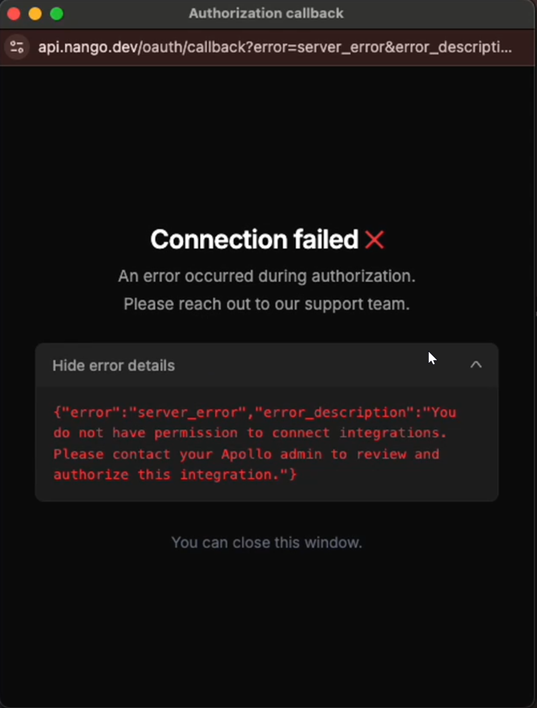
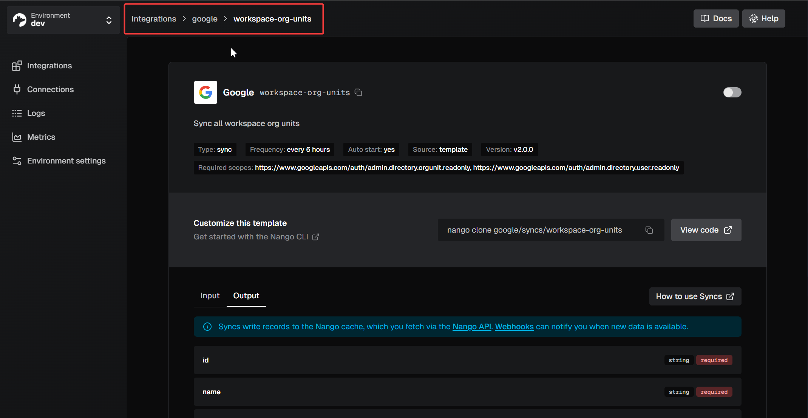
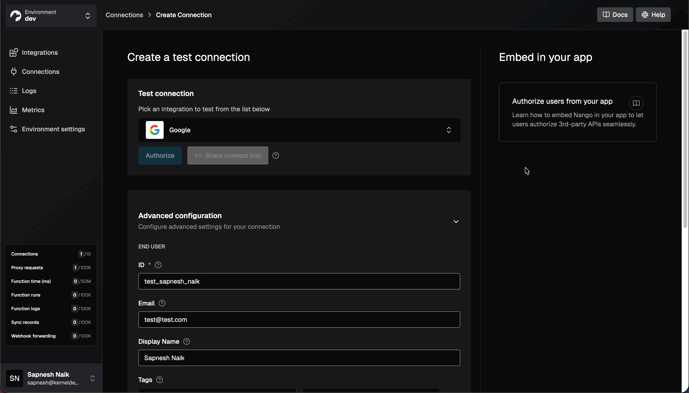
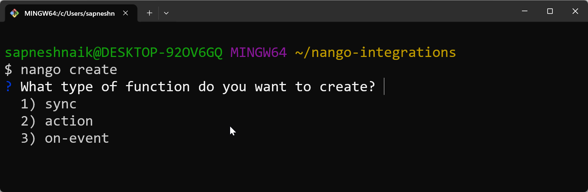

<Update label="January 2026">

  <AccordionGroup>
    <Accordion icon="webhook" title="37 new APIs in December">
      - [3CX](/api-integrations/3cx)
      - [8x8](/api-integrations/8x8)
      - [Adobe Commerce](/api-integrations/adobe-commerce)
      - [Atlassian Service Account (API Token)](/api-integrations/atlassian-service-account-api-token)
      - [Atlassian Service Account (OAuth 2.0)](/api-integrations/atlassian-service-account-oauth2)
      - [Bird](/api-integrations/bird)
      - [Canvas LMS](/api-integrations/canvas-lms)
      - [Cloudbeds](/api-integrations/cloudbeds)
      - [Constant Contact](/api-integrations/constant-contact)
      - [DemoDesk](/api-integrations/demodesk)
      - [Crisp (Plugin Install)](/api-integrations/crisp-plugin-install)
      - [ECU360 (Test)](/api-integrations/ecu360)
      - [ECU360 (Production)](/api-integrations/ecu360-production)
      - [FreeAgent](/api-integrations/freeagent)
      - [FreeAgent (Sandbox)](/api-integrations/freeagent-sandbox)
      - [Google Meet](/api-integrations/google-meet)
      - [Greenhouse Harvest Partner (V3)](/api-integrations/greenhouse-harvest-partner)
      - [Greenhouse Harvest (Client Credentials V3)](/api-integrations/greenhouse-harvest-oauth2-cc)
      - [Looker](/api-integrations/looker)
      - [Meta Marketing API](/api-integrations/meta-marketing-api)
      - [Juniper Mist](/api-integrations/juniper-mist)
      - [Mollie](/api-integrations/mollie)
      - [ModMed](/api-integrations/modmed)
      - [Nerdio](/api-integrations/nerdio)
      - [nocrm.io](/api-integrations/nocrm)
      - [Oomnitza](/api-integrations/oomnitza)
      - [Perdoo](/api-integrations/perdoo)
      - [Pylon](/api-integrations/pylon)
      - [Procore](/api-integrations/procore)
      - [Reapit Connect](/api-integrations/reapit)
      - [Schwab](/api-integrations/schwab)
      - [ServiceNow (Client Credentials)](/api-integrations/servicenow-oauth2-cc)
      - [Stripe (API Key)](/api-integrations/stripe-api-key)
      - [Wiseagent](/api-integrations/wiseagent)
      - [WorkOS](/api-integrations/workos)
      - [Workday (Refresh Token Auth)](/api-integrations/workday-refresh-token)
      - [Wise (API Key)](/api-integrations/wise-api-key)
    </Accordion>
  </AccordionGroup>
  
  ## Sync cache data retention and pruning

  We added automatic data retention policies for records stored in the Nango sync cache. These policies ensure payload data is not retained indefinitely.

  - **Automated payload pruning:** If a record has not been updated for 30 days, we automatically empty its payload. The metadata (ID, sync state, payload hash) remains intact so Nango can still track the record and detect future changes.
  - **Automated hard deletion:** If a sync has not executed for 60 days, we permanently delete all records belonging to that sync (payload and metadata).

  These policies take effect starting January 8, 2026. See the [Records cache documentation](/implementation-guides/use-cases/syncs/records-cache).

  We also introduced a new endpoint to manually prune records. You can use `PATCH /records/prune` to empty record payloads on demand while preserving the metadata. This endpoint uses cursor-based pagination via the `until_cursor` parameter to prevent collision issues during concurrent operations. See the [Prune records API reference](/reference/api/sync/prune-records).

  ## Support for Salesforce JWT Bearer auth

  You can now authenticate with Salesforce using the JWT Bearer flow. This enables server-to-server authentication using a dedicated "API user" inside the customer's Salesforce org.

  

  This auth mode bypasses the interactive OAuth consent screen, which is often preferred by enterprise customers for easier onboarding and stronger governance. It requires a Consumer Key, Consumer Secret, Private Key, and Username from a JWT-enabled Connected App.

  See the [Salesforce JWT documentation](https://nango.dev/docs/api-integrations/salesforce-jwt) for the setup guide and implementation snippets.

  ## Shareable Connect UI links

  You can now generate and copy a shareable Connect UI link directly from the Nango dashboard.

  

  The creation form includes a secondary button that mints a session-based URL. The UI displays an expiry notification when you copy the link to your clipboard. Links expire after 30 minutes.

  ## Mobile-friendly Connect UI

  We updated the Connect UI to optimize the layout for mobile devices.

  On viewports smaller than 640px, the UI now stretches to the full width of the screen. We removed wrapper padding, reduced inner padding, and removed rounded borders to maximize usable screen space.

  

  ## New blog posts

  We published a series of debugging guides detailing what causes OAuth refresh token `invalid_grant` or `BAD_REFRESH_TOKEN` errors and how to fix them across various providers:

  - [QuickBooks OAuth refresh token invalid_grant](https://www.nango.dev/blog/quickbooks-oauth-refresh-token-invalid-grant)
  - [Airtable OAuth refresh token invalid_grant](https://www.nango.dev/blog/airtable-oauth-refresh-token-invalid-grant)
  - [GitHub App OAuth BAD_REFRESH_TOKEN](https://www.nango.dev/blog/github-app-oauth-refresh-token-bad-refresh-token)
  - [Microsoft OAuth refresh token invalid_grant](https://www.nango.dev/blog/microsoft-oauth-refresh-token-invalid-grant)
  - [LinkedIn OAuth refresh token invalid_grant](https://www.nango.dev/blog/linkedin-oauth-refresh-token-invalid-grant)
  - [Slack OAuth refresh token invalid_grant](https://www.nango.dev/blog/slack-oauth-refresh-token-invalid-grant)
  - [Stripe OAuth refresh token invalid_grant](https://www.nango.dev/blog/stripe-oauth-refresh-token-invalid-grant)
  - [Shopify OAuth refresh token invalid_grant](https://www.nango.dev/blog/shopify-oauth-refresh-token-invalid-grant)
  - [Xero OAuth refresh token invalid_grant](https://www.nango.dev/blog/xero-oauth-refresh-token-invalid-grant)
  - [Linear OAuth refresh token invalid_grant](https://www.nango.dev/blog/linear-oauth-refresh-token-invalid-grant)
  - [PostHog OAuth refresh token invalid_grant](https://www.nango.dev/blog/posthog-oauth-refresh-token-invalid-grant)
  - [Notion OAuth refresh token invalid_grant](https://www.nango.dev/blog/notion-oauth-refresh-token-invalid-grant)
  - [Zendesk OAuth refresh token invalid_grant](https://www.nango.dev/blog/zendesk-oauth-refresh-token-invalid-grant)
  - [Jira OAuth refresh token invalid_grant](https://www.nango.dev/blog/jira-oauth-refresh-token-invalid-grant)
  - [Gong OAuth refresh token invalid_grant](https://www.nango.dev/blog/gong-oauth-refresh-token-invalid-grant)
  - [Confluence OAuth refresh token invalid_grant](https://www.nango.dev/blog/confluence-oauth-refresh-token-invalid-grant)

</Update>

<Update label="December 2025">
  <AccordionGroup>
    <Accordion icon="webhook" title="22 new APIs in December">
      - [Availity](/api-integrations/availity)
      - [BetterContact](/api-integrations/bettercontact)
      - [ConductorOne](/api-integrations/conductorone)
      - [Drata](/api-integrations/drata)
      - [Fanvue](/api-integrations/fanvue)
      - [Fathom (OAuth)](/api-integrations/fathom-oauth)
      - [Firstbase](/api-integrations/firstbase)
      - [Google Search Console](/integrations/all/google-search-console)
      - [Grist](/integrations/all/grist)
      - [Justworks](/api-integrations/justworks)
      - [Lumos](/api-integrations/lumos)
      - [Onlogist](/api-integrations/onlogist)
      - [Oracle Cloud Identity](/integrations/all/oracle-cloud-identity)
      - [Paylocity (NextGen)](/api-integrations/paylocity-nextgen)
      - [Recall.ai](/api-integrations/recall-ai)
      - [SAP S/4HANA Cloud (Client Credentials)](/api-integrations/sap-odata-oauth2-cc)
      - [SAP S/4HANA Cloud (Basic Auth)](/api-integrations/sap-odata-basic)
      - [Slab](/api-integrations/slab)
      - [Sophos Central](/api-integrations/sophos-central)
      - [Torii](/api-integrations/torii)
      - [Vanta](/api-integrations/vanta)
      - [Veeva Vault](/api-integrations/veeva-vault)
    </Accordion>
  </AccordionGroup>
  ## Connection tags

  Connections now support tags. Tags are key/value strings you attach when creating a Connect session to tie a Nango connection back to a specific user, organization, or entity in your system.

  When a user completes an auth flow, Nango copies these tags to the resulting connection and includes them in the success webhook. This replaces the need for the legacy `end_user` and `organization` objects.

  Tags also enhance the Nango UI:

  - `end_user_display_name` and `end_user_email` are shown directly in the connections list.
  - The domain from the `end_user_email` is used to automatically display the corresponding company logo on the connection detail page.

  You can also filter connections by tags via the API. See the [Connection tags documentation](/implementation-guides/platform/auth/connection-tags).

  **Migration Note:** If you currently use `end_user` or `organization` on Connect sessions or in webhooks, follow the [migration guide](/implementation-guides/platform/migrations/migrate-from-end-user) to move to tags. Existing connections have already been backfilled with tags derived from legacy end-user fields.

  ## Enhanced OAuth error messaging

  We rebuilt the callback experience to provide better visibility into OAuth errors. Provider error messages are now rendered directly inside the Connect UI form and the popup window

  

  The new UI for the callback renders structured success and error states. It also surfaces provider query parameters in an expandable debug panel. To ensure reliable teardown and state sharing, the popup relays these states back to the SDK via `postMessage` (with a `BroadcastChannel` fallback) and remains open until acknowledged.

  Additionally, provider errors are now delivered via WebSocket for improved logging on your end.

  ## Redesigned Integrations Experience

  We have overhauled the Integrations tab to streamline how you manage and scale your catalog. This update focuses on faster discovery and a more intuitive setup flow.

  - **Improved Search:** The search on the Integrations page now considers display names, auth modes, and categories to bring you the most relevant results. The search bar is now auto-focused by default.\\

    
  - **Decoupled Creation Flow:** Selecting an API in the catalog now leads to a dedicated form where you configure credentials (Client ID, Secret, Scopes) before the integration is created. This prevents empty integrations from cluttering your dashboard.
  - **Improved Navigation:** Added breadcrumbs to the header for better context in nested routes and a new search bar for your active integrations list. \\

    

  ## New blog posts

  New posts from the Nango team in December:

  - [Finding traction without a product: Our process](https://www.nango.dev/blog/our-process-for-finding-initial-traction-pre-product)
  - [How to find the best integrations partner](https://www.nango.dev/blog/how-to-find-the-best-integrations-partner)
</Update>
---
<Update label="November 2025">
  <AccordionGroup>
    <Accordion icon="webhook" title="27 new APIs in November">
      - [Apify](/integrations/all/apify)
      - [Auvik](/integrations/all/auvik)
      - [Breezy HR](/integrations/all/breezy-hr)
      - [CrowdStrike](/integrations/all/crowdstrike)
      - [Cursor Admin](/integrations/all/cursor-admin)
      - [Crisp](/integrations/all/crisp)
      - [DrChrono](/integrations/all/drchrono)
      - [ContactOut](/integrations/all/contactout)
      - [Fellow](/api-integrations/fellow)
      - [GitLab (Personal Access Token)](/integrations/all/gitlab-pat)
      - [HeyReach](/integrations/all/heyreach)
      - [Icypeas](/integrations/all/icypeas)
      - [LeadMagic](/integrations/all/leadmagic)
      - [Mimecast](/integrations/all/mimecast)
      - [NinjaOne RMM](/integrations/all/ninjaone-rmm)
      - [Passportal](/integrations/all/passportal)
      - [Rocketlane](/integrations/all/rocketlane)
      - [Prospeo](/integrations/all/prospeo)
      - [PracticeFusion](/api-integrations/practicefusion)
      - [Semrush (v3)](/integrations/all/semrush)
      - [Shipstation (v2)](/integrations/all/shipstation-v2)
      - [TikTok Personal](/integrations/all/tiktok-personal)
      - [Valley (API Key)](/integrations/all/valley-api-key)
      - [Valley (OAuth)](/integrations/all/valley)
      - [Wiza](/integrations/all/wiza)
      - [Zendesk Sell](/integrations/all/zendesk-sell)
      - [Zoho Recruit](/integrations/all/zoho-recruit)
    </Accordion>
  </AccordionGroup>
  ## Advanced connection settings

  You can now set advanced configurations directly in the Nango UI when creating a connection. This form is split into two distinct sections.

  First, you can specify end-user data. This includes setting a custom ID, email, and display name for the connection.

  

  Second, you can override the integration's default configurations. You can modify authorization parameters, customize OAuth scopes, and override developer app credentials (such as the Client ID and Client Secret). This allows you to test connections and initiate the authorization flow even if default credentials are not fully configured in your environment.

  ## Template cloning via CLI

  The Nango CLI now includes a `nango clone` command. This automates the process of pulling function templates and their dependencies from the Nango integration templates repository.

  This replaces the manual process of copying and pasting configuration and TypeScript code. You can clone an entire integration directory, a specific category of functions, or an individual template.

  ```bash
  nango clone github     
  nango clone github/actions               
  nango clone github/actions/list-repos
  ```

  The command supports zero-yaml projects. It safely handles file resolution by confirming before overwriting existing files and automatically updating your local `index.ts` to reference the newly cloned scripts.

  See the guide on [customizing a function template](/implementation-guides/platform/functions/customize-template).

  ## Better support for Monorepos & Package Managers

  We’ve overhauled how the Nango CLI detects and interacts with your environment, specifically for non-NPM setups:

  - **Monorepo detection**: The CLI now traverses parent directories to find your lockfile or `package.json`. If you run `nango init` in a subdirectory, it will correctly identify and use your root `pnpm`, `yarn`, or `bun` configuration.
  - **Opt-out of auto-installs**: To prevent the CLI from modifying `package.json` in sensitive environments (like CI or projects using pnpm catalogs), use the new `--no-dependency-update` flag or set the `NANGO_CLI_DEPENDENCY_UPDATE=false` environment variable.
  - **Yarn compatibility**: `nango init` now works out of the box for Yarn users, correctly flagging projects as standalone and using the `node-modules` linker.

  ## New blog posts

  New posts from the Nango team in November:

  - [How to build integrations you and your customers love](https://www.notion.so/blog/how-to-build-integrations-you-and-your-customers-love)
  - [The hidden costs of building product integrations in-house](https://www.notion.so/blog/the-hidden-costs-of-building-product-integrations-in-house)
  - [Product integrations: Build or buy?](https://www.notion.so/blog/product-integrations-build-or-buy)
</Update>
---
<Update label="October 2025">
  <AccordionGroup>
    <Accordion icon="webhook" title="23 new APIs in October">
      - [Adobe Workfront](/integrations/all/adobe-workfront)
      - [Affinity (v2)](/integrations/all/affinity-v2)
      - [Aimfox](/integrations/all/aimfox)
      - [Aimfox (OAuth)](/integrations/all/aimfox-oauth)
      - [Atlassian Government Cloud](/integrations/all/atlassian-government-cloud)
      - [Folk](/integrations/all/folk)
      - [Ironclad](/integrations/all/ironclad)
      - [Loop Returns](/integrations/all/loop-returns)
      - [MCP Server OAuth2 (Generic)](/integrations/all/mcp-generic)
      - [Microsoft (Admin)](/integrations/all/microsoft-admin)
      - [Microsoft Excel](/integrations/all/microsoft-excel)
      - [Momentum.io](/integrations/all/momentum-io)
      - [OneDrive Personal](/integrations/all/one-drive-personal)
      - [OneLogin](/integrations/all/onelogin)
      - [Pennylane (Company API)](/integrations/all/pennylane-company-api)
      - [PingOne](/integrations/all/pingone)
      - [PingOne (Client Credentials)](/integrations/all/pingone-cc)
      - [SAP Fieldglass](/integrations/all/sap-fieldglass)
      - [SAP Business One](/integrations/all/sap-business-one)
      - [Statista](/integrations/all/statista)
      - [Streak](/integrations/all/streak)
      - [Teamleader Focus](/integrations/all/teamleader)
      - [Snipe-IT](/integrations/all/snipe-it)
    </Accordion>
  </AccordionGroup>
  ## CLI interactive mode

  The Nango CLI now supports an [interactive mode](https://nango.dev/docs/reference/cli#interactive-mode) that prompts for missing arguments. For example, run `nango create` without specifying the function type, integration, or name, and the CLI will ask for them. Interactive mode is on by default in interactive terminal sessions.

  

  You can still provide all arguments upfront to skip prompts (e.g., for scripting): test `nango create --sync --integration my-api --name get-contacts`

  To disable interactive mode, use the `--no-interactive` flag, or set the `CI` environment variable for CI/CD environments.

  ## Change in mock file structure for Nango integration tests

  We have moved from a multi-file mock format to a single `.test.json`.

  When you generate mocks for your Nango syncs or actions, a single `.test.json` file is generated next to your test file. The file contains input, output, Nango stubs, and API response mocks, organized by method and path. This keeps test data in one place, making tests easier to run and maintain. See [mock file structure](/implementation-guides/platform/functions/testing#mock-file-structure).

  **Migration Note:** See [migrating from the old format](/implementation-guides/platform/functions/testing#migrating-from-the-old-format) if you have tests still using the old multi-file mocks.

  ## Integrating Nango into your CI/CD processes

  - [CI/CD for Nango integrations](/implementation-guides/platform/functions/ci-cd#ci-cd-for-nango-integrations): A complete guide on integrating Nango into your CI/CD processes.

  ## New blog posts

  New posts from the Nango team in October:

  - [Best practices for building a unified API](https://www.nango.dev/blog/best-practices-build-unified-api)
  - [HubSpot OAuth BAD_REFRESH_TOKEN — What it means & how to fix it](https://www.nango.dev/blog/hubspot-oauth-bad-refresh-token)
  - [Best iPaaS for API Unification](https://www.nango.dev/blog/best-ipaas-for-api-unification)
  - [Paragon's pricing: What You Should Know Before Signing Up](https://www.nango.dev/blog/paragon-pricing)
  - [Merge pricing: What you should know before you commit](https://www.nango.dev/blog/merge-pricing)
  - [The 4 most popular Paragon alternatives](https://www.nango.dev/blog/4-most-popular-paragon-alternatives)
  - [The 4 most popular Merge.dev alternatives](https://www.nango.dev/blog/4-most-popular-merge-dev-alternatives)
</Update>
---
<Update label="September 2025">
  <AccordionGroup>
    <Accordion icon="webhook" title="28 new APIs in September">
      - [Addepar (OAuth)](/integrations/all/addepar)
      - [Addepar (Basic Auth)](/integrations/all/addepar-basic)
      - [ADP Lyric](/integrations/all/adp-lyric)
      - [ADP Workforce Now](/integrations/all/adp-workforce-now)
      - [Bullhorn](/integrations/all/bullhorn)
      - [Clerk](/integrations/all/clerk)
      - [Cursor](/integrations/all/cursor)
      - [DataCandy](/integrations/all/datacandy)
      - [Fillout (API Key)](/integrations/all/fillout-api-key)
      - [Fillout (Oauth)](/integrations/all/fillout)
      - [Google Workspace Admin](/integrations/all/google-workspace-admin)
      - [Google Service Account](/integrations/all/google-service-account)
      - [Hover](/integrations/all/hover)
      - [Jobber](/integrations/all/jobber)
      - [Kintone](/integrations/all/kintone)
      - [Kintone User API](/integrations/all/kintone-user-api)
      - [Pax8](/integrations/all/pax8)
      - [Recruitee](/integrations/all/recruitee)
      - [Sellsy](/integrations/all/sellsy)
      - [Sellsy (Client Credentials)](/integrations/all/sellsy-oauth2-cc)
      - [Skio](/integrations/all/skio)
      - [Snapchat (Ads API)](/integrations/all/snapchat)
      - [Tailscale (OAuth)](/integrations/all/tailscale)
      - [Tailscale (API Key)](/integrations/all/tailscale-api-key)
      - [Webex](/integrations/all/webex)
    </Accordion>
  </AccordionGroup>
  ---

  ## Connect UI settings

  <Frame>
    
  </Frame>
  Customize the Connect UI, which your users see when they authorize integrations.

  We've added a dark mode and the ability to change the primary color to fit your brand. You can also toggle the light/dark mode based on the user's system preference.

  Access the Connect UI settings in your [Environment settings](https://app.nango.dev/dev/environment-settings). We will continue adding customization options over time.

  ---

  ## Improved deletion detection when syncing data

  For APIs that don't support deletion detection, we've added a new interface to detect deletions on Nango's side when syncing data ([docs](/implementation-guides/use-cases/syncs/deletion-detection#detecting-deletes-in-syncs-without-checkpoints)).

  Inside your sync function, you can now call `nango.deleteRecordsFromPreviousExecutions('ModelName')` to detect deletions.

  Please note that you should only use this function if you are performing a full sync. If you are syncing data incrementally, you can periodicaly resync the whole dataset to benefit from deletion detection.

  ---

  ## Custom credentials verification

  We added the ability to customize the credentials verification script, which is called when a new connection is created. For this, use the new `validate-connection` hook ([docs](/implementation-guides/use-cases/implement-event-handler)).

  This lets you verify your customers’ API credentials by testing them against specific endpoints that correspond to particular API scopes.

  ---
</Update>

/

<Update label="August 2025">
  <AccordionGroup>
    <Accordion icon="webhook" title="23 new APIs in August">
      - [RUN Powered by ADP](/integrations/all/adp-run)
      - [ADP Workforce Now Next Generation](/integrations/all/adp-workforce-now-next-gen)
      - [AutoTask](/integrations/all/autotask)
      - [Avoma](/integrations/all/avoma)
      - [Dayforce](/integrations/all/dayforce)
      - [Datto RMM](/integrations/all/datto-rmm)
      - [Datto RMM (Password Grant)](/integrations/all/datto-rmm-password-grant)
      - [Fairing](/integrations/all/fairing)
      - [Float](/integrations/all/float)
      - [Heap](/integrations/all/heap)
      - [IT Glue](/integrations/all/itglue)
      - [JobDiva](/integrations/all/jobdiva)
      - [JumpCloud](/integrations/all/jumpcloud)
      - [Paycor](/integrations/all/paycor)
      - [Paycor (Sandbox)](/integrations/all/paycor-sandbox)
      - [Pipedream (API Key)](/integrations/all/pipedream)
      - [Pipedream (Client Credentials)](/integrations/all/pipedream-oauth2-cc)
      - [Private API (Bearer Auth)](/integrations/all/private-api-bearer)
      - [Private API (Basic Auth)](/integrations/all/private-api-basic)
      - [Roller](/integrations/all/roller)
      - [Sage People](/integrations/all/sage-people)
      - [Yotpo](/integrations/all/yotpo)
      - [Zoho Calendar](/integrations/all/zoho-calendar)
    </Accordion>
  </AccordionGroup>
  ---

  ## TypeScript-based script configs

  <Frame>
    
  </Frame>
  Integration scripts now use TypeScript for configuration, colocated with your script code. Benefits:

  - Strong type safety
  - Better tooling (auto-complete, linting)
  - No custom syntax to learn

  This makes writing and maintaining custom integrations simpler, whether you code them manually or generate them with an LLM. [Migration guide](/implementation-guides/platform/migrations/migrate-to-zero-yaml).

  ---

  ## Developer updates distribution

  You’ll now receive important developer updates about deprecations, breaking changes, and other integration-impacting news in a more structured way:

  - **Email**: Sent to everyone who signs up (with the option to unsubscribe).
  - **Private Slack channels**: Delivered directly if your team has a dedicated channel with us.
  - **Community Slack**: Shared in the `#dev-updates` channel.
  - **Docs**: Dedicated [Dev Updates changelog](/updates/dev).

  ---

  ## Separate rate limits for Script API vs. Public API

  Script API calls and Public API calls are now rate-limited separately. This prevents heavy script usage from affecting your ability to use the Public API (and vice versa). Both limits are soft and can be increased per customer. Limits are now properly reported in the Nango logs.

  ---

  ## New getting started flow

  A redesigned onboarding screen helps you set up your first integration and call an API right after signup. This makes it easier to experience Nango’s value in just a few minutes.

  ---
</Update>

<Update label="July 2025">
  <AccordionGroup>
    <Accordion icon="webhook" title="9 new APIs in July">
      - [Atlassian Cloud Admin](/integrations/all/atlassian-admin)
      - [AWS (SCIM)](/integrations/all/aws-scim)
      - [Azure Blob Storage](/integrations/all/azure-blob-storage)
      - [Fathom](/integrations/all/fathom)
      - [Google Chat](/integrations/all/google-chat)
      - [Google Cloud Storage](/integrations/all/google-cloud-storage)
      - [KnowBe4 (Reporting)](/integrations/all/knowbe4)
      - [Paycom](/integrations/all/paycom)
      - [Setmore](/integrations/all/setmore)
    </Accordion>
  </AccordionGroup>
  ## Nango-provided OAuth apps for testing

  <Frame>
    
  </Frame>
  When testing OAuth APIs, you can now use Nango-provided developer apps instead of setting up your own.

  - Available for top APIs (more being added over time).
  - Select this option when creating a new integration.
  - For **testing only**—production apps should still use your own credentials to keep Nango fully white-labeled.

  ---

  ## Edit user & org info

  You can now edit the user and organization information attached to a connection. This info is visible in the Nango dashboard, helping you manage connections more easily.\
  [API reference](/reference/api/connections/patch).

  ---

  ## Faster action execution

  Action execution latency has been reduced from **more than 200ms+** to **less than 50ms**. This makes actions feel much more responsive, especially when a human is waiting for the result.

  ---

  ## API-specific docs with getting started

  Each API-specific doc now includes a “Getting Started” section so you can:

  1. Run the auth flow
  2. Make a first successful API request

  All in **under 5 minutes**. Example: [Google Calendar docs](/integrations/all/google-calendar).

  ---
</Update>

<Update label="June 2025">
  <AccordionGroup>
    <Accordion icon="webhook" title="7 new APIs in June">
      - [Jobvite](/integrations/all/jobvite)
      - [Roam (SCIM API)](/integrations/all/roam-scim)
      - [Sage HR](/integrations/all/sage-hr)
      - [Sentry (Public Integrations)](/integrations/all/sentry-oauth)
      - [Trafft](/integrations/all/trafft)
      - [UKG Pro](/integrations/all/ukg-pro)
      - [UKG Ready](/integrations/all/ukg-ready)
    </Accordion>
  </AccordionGroup>
  ## Generate integrations with AI

  <Frame>
    
  </Frame>
  We published a new guide on using AI to generate integrations faster than coding them manually. You can still edit the generated code as needed.\
  [Guide](/implementation-guides/platform/functions/leverage-ai-agents).

  ---

  ## Self-serve subscription upgrades

  You can now upgrade or downgrade your plan directly in the Nango UI, under **Usage & Billing**.\
  _Note: Legacy plans still require contacting us._

  ---

  ## Usage reporting

  The **Usage & Billing** tab now includes detailed usage reports:

  - Track all metrics that affect billing.
  - See past invoices with a full breakdown.

  ---

  ## Improved self-hosted release process

  We’ve formalized the release process for self-hosted Enterprise customers:

  - Two-month release cadence
  - Semantic versioning adopted
  - Clearer update process in the [self-hosting docs](/guides/platform/self-hosting#updates).

  ---
</Update>

<Update label="May 2025">
  <AccordionGroup>
    <Accordion icon="webhook" title="18 new APIs in May">
      - [Canva](/integrations/all/canva)
      - [Codegen](/integrations/all/codegen)
      - [Confluence Data Center](/integrations/all/confluence-data-center/)
      - [Dropbox Sign](/integrations/all/dropbox-sign)
      - [Grammarly SCIM](/integrations/all/grammarly-scim)
      - [Google Slides](/integrations/all/google-slides)
      - [Jamf Pro (Client Credentials)](/integrations/all/jamf)
      - [Jamf Pro (Basic Auth)](/integrations/all/jamf-basic)
      - [JazzHR](/integrations/all/jazzhr)
      - [Jobadder](/integrations/all/jobadder)
      - [Kandji](/integrations/all/kandji)
      - [Open Hands](/integrations/all/open-hands)
      - [Paychex](/integrations/all/paychex)
      - [PreciseFP](/integrations/all/precisefp)
      - [Recruitcrm](/integrations/all/recruitcrm)
      - [Recruiterflow](/integrations/all/recruiterflow)
      - [Supabase](/integrations/all/supabase)
      - [Terraform](/integrations/all/terraform)
    </Accordion>
  </AccordionGroup>
  ## Nango as an MCP server

  <Frame>
    
  </Frame>
  Nango can now act as a remote MCP server, exposing third-party API actions as tools for your AI agents.

  - Build and enable/disable tools with Nango actions.
  - Use them via the MCP protocol.\
    [Guide](/implementation-guides/use-cases/tool-calling/overview).

  ---

  ## Localized Connect UI

  You can now localize the Connect UI:

  - Choose a language.
  - Override links to end-user guides with your own versions.\
    [Docs](/reference/sdks/frontend#param-lang).

  ---

  ## Asynchronous actions

  You can now run actions asynchronously—triggering them without waiting for an immediate result. This is useful when:

  - Tasks take a long time to complete.
  - You don’t need the response right away.
  - Actions should be retried for reliability.
  - You’re sending many actions at once.\
    [Docs](/implementation-guides/use-cases/actions/async-actions).

  ---

  ## Granular time windows in logs

  You can now filter logs by precise time windows, making it easier to drill down into specific events for debugging.

  ---
</Update>

<Update label="April 2025">
  <AccordionGroup>
    <Accordion icon="webhook" title="27 new APIs in April">
      - [ADP](/integrations/all/adp)
      - [Auth0 (Client Credentials)](/integrations/all/auth0-cc)
      - [Azure DevOps](/integrations/all/azure-devops)
      - [ClickSend](/integrations/all/clicksend)
      - [CompanyCam](/integrations/all/companycam)
      - [Confluence (Basic Auth)](/integrations/all/confluence-basic)
      - [Cyberimpact](/integrations/all/cyberimpact)
      - [Devin](/integrations/all/devin)
      - [DocuWare](/integrations/all/docuware)
      - [Employment Hero](/integrations/all/employment-hero)
      - [Gem](/integrations/all/gem)
      - [Grammarly](/integrations/all/grammarly)
      - [Github (Personal Access Token)](/integrations/all/github-pat)
      - [Incident.io](/integrations/all/incident-io)
      - [Jira Data Center (Basic Auth)](/integrations/all/jira-data-center-basic)
      - [Namely](/integrations/all/namely)
      - [Namely (PAT)](/integrations/all/namely-pat)
      - [Redtail CRM (Sandbox)](/integrations/all/redtail-crm-sandbox)
      - [Rock Gym Pro](/integrations/all/rock-gym-pro)
      - [Rootly](/api-integrations/rootly)
      - [Sentry](/integrations/all/sentry)
      - [Shopify Partner](/integrations/all/shopify-partner)
      - [Smartlead.ai](/integrations/all/smartlead-ai)
      - [Snowflake (JWT)](/integrations/all/snowflake-jwt)
      - [UKG Pro (Workforce Management)](/integrations/all/ukg-pro-wfm)
      - [Vercel](/integrations/all/vercel)
      - [Workday (OAuth)](/api-integrations/workday-oauth)
    </Accordion>
  </AccordionGroup>
  ---

  ## Usage-based pricing

  <Frame>
    
  </Frame>
  Nango now offers transparent, usage-based pricing starting at \$50/month.

  - Pricing scales with usage: connections, action executions & record syncs
  - Volume discounts up to 100x included
  - 1,000 free connections still available on the Free plan (unlimited on Free Self-Hosted)
  - Add-ons are priced individually on a monthly basis—no large annual commitments

  ---

  ## Logs search

  <Frame>
    
  </Frame>
  The _Logs_ tab is now much more powerful with full-text search and performance improvements.

  - Search across log and sub-log contents via the top-level search bar
  - Filter logs using record IDs to investigate when records were synced
  - Improved navigation and load times across the tab

  ---

  ## Enterprise self-hosting with ECS + Terraform

  <Frame>
    
  </Frame>
  We’ve published a new [guide](/guides/platform/self-hosting) for self-hosting Nango on AWS ECS, including a ready-to-use Terraform configuration.

  - Automates installation for Enterprise customers
  - Complements our existing Helm chart for Kubernetes
  - Ongoing work to further simplify self-hosting

  The Terraform configuration is available upon request.

  ---

  ## Create, edit & delete environments

  <Frame>
    
  </Frame>
  You can now manage multiple environments directly from the Nango dashboard. This makes it easier to isolate development stages or segment customer-specific setups.

  - Growth plan includes 3 environments by default
  - Additional environments available via paid add-on

  ---
</Update>

<Update label="March 2025">
  <AccordionGroup>
    <Accordion icon="webhook" title="17 new APIs in March">
      - [ActiveCampaign](/integrations/all/active-campaign)
      - [Anthropic Administrator](/integrations/all/anthropic-admin)
      - [Blackbaud (Basic Auth)](/integrations/all/blackbaud-basic)
      - [Callrail](/integrations/all/callrail)
      - [Figma (SCIM)](/integrations/all/figma-scim)
      - [Microsoft (Client Credentials)](/integrations/all/microsoft-oauth2-cc)
      - [Missive](/integrations/all/missive)
      - [Oracle Fusion Cloud (HCM)](/integrations/all/oracle-hcm)
      - [Pandadoc (API Key)](/integrations/all/pandadoc-api-key)
      - [Razorpay](/integrations/all/razorpay)
      - [Readwise](/integrations/all/readwise)
      - [Readwise Reader](/integrations/all/readwise-reader)
      - [Rippling Shop App](/integrations/all/rippling-shop-app)
      - [SharePoint Online (Client Credentials V2)](/integrations/all/sharepoint-online-oauth2-cc)
      - [Trakstar Hire](/integrations/all/trakstar-hire)
      - [tl;dv](/integrations/all/tldv)
      - [Xero (Client Credentials)](/integrations/all/xero-oauth2-cc)
    </Accordion>
  </AccordionGroup>
  ---

  ## Authorization logs

  <Frame>
    
  </Frame>
  Gain visibility into how your users interact with the Connect UI during the authorization process.

  Nango now tracks and logs key authorization events:

  - User opened or closed the Connect UI
  - User opened or closed the OAuth modal
  - User viewed a new screen (integration list, input form, success/failure)

  You can explore these events in the _Logs_ tab of the Nango UI.

  We also added a chart summarizing all authorization attempts by outcome:

  - Success
  - Cancelled
  - Technical failure

  This chart is available on the _Home_ tab.

  Watch the demo:

  <div style={{ position: 'relative', overflow: 'hidden', paddingTop: '56.25%' }}>
  <iframe src="https://www.loom.com/embed/ba30523220f94bf3a8def8bf5f2b92c2" frameBorder="0" allowFullScreen style={{ position: 'absolute', top: 0, left: 0, width: '100%', height: '100%' }} title="Loom video" />
</div>

  ---

  ## AI agent support

  <Frame>
    
  </Frame>
  We’ve added support for AI agents to consume Nango as part of automated workflows involving external APIs.

  Nango simplifies API orchestration, making it easier for AI agents to execute unitary, high-level actions without managing individual API calls or credentials.

  What’s new:

  - [**Introspection endpoint**](https://nango.dev/docs/reference/api/scripts/config): List available actions programmatically, exportable as OpenAI tools
  - [**Action trigger endpoint**](https://nango.dev/docs/reference/api/action/trigger): Run actions reliably via the API
  - [**Integrated authorization**](/guides/primitives/auth): Use Nango’s pre-built UI to securely prompt users for access

  This makes it easier to build AI agents that can reliably interact with 600+ APIs.

  Get inspired by [AI companies using Nango](https://www.nango.dev/blog/nango-for-ai).

  ---

  ## AI agent demo video

  <Frame>
    
  </Frame>
  We published a demo showing how AI agents can use Nango to trigger actions across 600+ APIs and integrations.

  See how AI agents benefit from:

  - Reliable abstractions for complex API workflows
  - Built-in authorization flows
  - Reduced surface for API errors

  Watch the demo:

  <div style={{ position: 'relative', overflow: 'hidden', paddingTop: '56.25%' }}>
  <iframe src="https://www.loom.com/embed/bdf871464fd148048ffe00eba3a1b982" frameBorder="0" allowFullScreen style={{ position: 'absolute', top: 0, left: 0, width: '100%', height: '100%' }} title="Loom video" />
</div>

  If you want to run the demo yourself or check the code, here is the demo's [GitHub repo](https://github.com/NangoHQ/ai-agent-demo).
</Update>

<Update label="February 2025">
  <AccordionGroup>
    <Accordion icon="webhook" title="26 new APIs in February">
      - [1Password (SCIM)](/integrations/all/1password-scim)
      - [Airtable (Personal Access Token)](/integrations/all/airtable-pat)
      - [Amazon Selling Partner](/integrations/all/amazon-selling-partner)
      - [Amazon Selling Partner (Beta)](/integrations/all/amazon-selling-partner-beta)
      - [Appstle Subscriptions](/integrations/all/appstle-subscriptions)
      - [Check](/integrations/all/checkhq)
      - [Commercetools](/integrations/all/commercetools)
      - [Drupal](/integrations/all/drupal)
      - [Google Gemini](/integrations/all/google-gemini)
      - [Guru (SCIM)](/integrations/all/guru-scim)
      - [Gorgias (Basic Auth)](/integrations/all/gorgias-basic)
      - [Jira Data Center (API Key)](/integrations/all/jira-data-center-api-key)
      - [lemlist](/integrations/all/lemlist)
      - [Loom (SCIM)](/integrations/all/loom-scim)
      - [MiniMax](/integrations/all/minimax)
      - [MIP Cloud](/integrations/all/mip-cloud)
      - [MIP On Premise](/integrations/all/mip-on-premise)
      - [OpenAI (Admin)](/integrations/all/openai-admin)
      - [Paylocity](/api-integrations/paylocity)
      - [Quickbase](/integrations/all/quickbase)
      - [Retell AI](/integrations/all/retell-ai)
      - [Rippling](/integrations/all/rippling)
      - [Sage Intacct (OAuth)](/integrations/all/sage-intacct-oauth)
      - [Salesforce (Data Cloud)](/integrations/all/salesforce-cdp)
      - [SAP Concur](/integrations/all/sap-concur)
      - [xAI](/integrations/all/xai)
    </Accordion>
  </AccordionGroup>
  ---

  ## Sync partitioning

  <Frame>
    
  </Frame>
  Syncing is now **faster and more efficient** with **Sync partinioning**. Instead of processing large syncs at once, you can now break them down into smaller, parallel syncs, improving performance and responsiveness.

  For example, instead of syncing an entire spreadsheet, you can sync each sheet separately so that each one syncs faster. This is ideal for large datasets or real-time syncing.

  The API and UI give you full control over these syncs, letting you create, manage, and monitor them with ease.

  [Learn more in the docs](/implementation-guides/use-cases/syncs/sync-partitioning).

  ---

  ## Revamped environment settings

  <Frame>
    
  </Frame>
  We overhauled the _Environment Settings_ UI. This was one of the oldest sections of the app but is critical for setting up and configuring Nango.

  The new design organizes settings into clear sections: backend, notifications, scripts & export.

  Each setting now includes links to relevant documentation for easier navigation.

  Check it out in the _Environment Settings_ tab in the [Nango UI](https://app.nango.dev/).

  ---

  ## Detailed webhook logs

  <Frame>
    
  </Frame>
  Webhooks are a key part of Nango, notifying you of critical events such as authorization completion, sync completion, and error cases.

  We've added **granular logs** for all webhook types, allowing you to inspect individual webhook deliveries. You can now view the request/response payloads, filter by log type/status/timestamp and quickly debug failed webhook deliveries.

  Check it out in the _Logs_ tab in the [Nango UI](https://app.nango.dev/).

  ---

  ## Real-time syncing strategies

  <Frame>
    
  </Frame>
  Syncing real-time webhooks alongside periodic polling can cause conflicts, especially when APIs send partial updates. To solve this, we have introduced **new merging strategies** for better data accuracy.

  **How updates are handled**

  - **Deep merge (default)**: Nango merges partial updates automatically.
  - **Custom updates**: Fetch full records by ID and modify them manually.

  **How conflicts are resolved**

  - **Most recent update wins (default)**: The latest write—whether from a webhook or a periodic sync—always updates the record.
  - **Ignore older updates**: When polling, Nango checks if a newer webhook update exists. If so, it preserves the more recent webhook data instead of overwriting it.

  [Learn more in the docs](/implementation-guides/use-cases/syncs/realtime-syncs#sync-concurrency-considerations).

  ---
</Update>

<Update label="January 2025">
  <AccordionGroup>
    <Accordion icon="webhook" title="12 new APIs in January">
      - [Basecamp](/integrations/all/basecamp)
      - [FindyMail](/integrations/all/findymail)
      - [Gebruder Weiss](/integrations/all/gebruder-weiss)
      - [La Growth Machine](/integrations/all/lagrowthmachine)
      - [Lucid](/integrations/all/lucid-scim)
      - [Microsoft Business Central](/integrations/all/microsoft-business-central)
      - [Odoo](/integrations/all/odoo)
      - [Recharge](/integrations/all/recharge)
      - [Scrape.do](/integrations/all/scrapedo)
      - [SharePoint Online (v1)](/api-integrations/sharepoint-online)
      - [Shopify (API Key)](/integrations/all/shopify)
      - [Shopify (SCIM API)](/integrations/all/shopify)
    </Accordion>
  </AccordionGroup>
  ---

  ## Trigger syncs

  <Frame>
    
  </Frame>
  You can now trigger syncs directly from the Nango UI with customizable options. The new modal allows you to trigger syncs incrementally, retrieving only the data modified since the last sync, or fully, fetching all historical data. Additionally, you can choose to clear the cached data if needed. To trigger a sync, navigate to the Connections tab, select a connection, go to the Syncs sub-tab, and click the “…” menu.

  ---

  ## Lighter CLI

  <Frame>
    
  </Frame>
  The CLI is now drastically lighter, going from more than 30 seconds to less than 2 seconds to install.

  ---

  ## Create environments

  <Frame>
    
  </Frame>
  You can now create new environments in Nango, beyond the default _Production_ and _Dev_ environemnts. Simply use the dropfown at the top of the left nav bar in the [Nango UI](https://app.nango.dev). This feature is available for paid plans only.

  ---

  ## Event-based scripts

  <Frame>
    
  </Frame>
  Nango now supports event-based scripts, which are executed automatically after specific events, such as connection creation or deletion. These scripts enable you to automate tasks like registering or deregistering webhooks. For more details, check out the [guide](/implementation-guides/use-cases/implement-event-handler).

  ---
</Update>

<Update label="December 2024">
  <AccordionGroup>
    <Accordion icon="webhook" title="15 new APIs in December">
      - [Atlas.so](/integrations/all/atlas-so)
      - [Braze](/integrations/all/braze)
      - [BuiltWith](/integrations/all/builtwith)
      - [Canva (SCIM API)](/integrations/all/canva-scim)
      - [Copper](/integrations/all/copper)
      - [Emarsys (OAuth)](/integrations/all/emarsys)
      - [eBay](/integrations/all/ebay)
      - [Fortnox](/integrations/all/fortnox)
      - [Freshteam](/integrations/all/freshteam)
      - [Gerrit](/integrations/all/gerrit)
      - [LastPass](/integrations/all/lastpass)
      - [Lattice](/integrations/all/lattice)
      - [Personio (v2)](/integrations/all/personio)
      - [SAP SuccessFactors](/api-integrations/sap-success-factors)
      - [Zapier](/api-integrations/zapier)
    </Accordion>
  </AccordionGroup>
  ---

  ## Resilient integrations

  <Frame>
    
  </Frame>
  Integration executions are no longer disrupted during runner VM upgrades. The VMs now wait for ongoing executions to complete before proceeding with the upgrade. This enhancement minimizes interruptions, especially for long-running syncs that can take up to 24 hours.

  ---

  ## Surface misconfigured integrations

  <Frame>
    
  </Frame>
  The Nango UI now highlights misconfigured integrations, such as those missing OAuth app credentials. An error icon will appear next to the misconfigured integration in the _Integrations_ tab of the [Nango UI](https://app.nango.dev).

  ---

  ## Getting started tab

  <Frame>
    
  </Frame>
  The Nango UI now includes a _Getting Started_ tab featuring a 2-minute demo video and essential guides to help you get started. You can dismiss this tab when it's no longer needed, but it will remain accessible from the bottom-left menu.

  ---

  ## API catalog

  <Frame>
    
  </Frame>
  You can now search through [all the APIs supported by Nango](https://www.nango.dev/api-integrations). This list is automatically updated whenever new APIs are added.

  ---
</Update>

<Update label="November 2024">
  <AccordionGroup>
    <Accordion icon="webhook" title="16 new APIs in November">
      - [Asana (SCIM API)](/api-integrations/asana)
      - [AWS IAM](/integrations/all/aws)
      - [Beehiiv](/integrations/all/beehiiv)
      - [Brevo (API Key)](/integrations/all/brevo-api-key)
      - [BrightCrowd](/integrations/all/brightcrowd)
      - [Emarsys Core API](/integrations/all/emarsys)
      - [Grain](/integrations/all/grain)
      - [Grain (API Key)](/integrations/all/grain)
      - [Mindbody (API Key)](/integrations/all/mindbody)
      - [Okta (Preview)](/integrations/all/okta)
      - [Plain](/integrations/all/plain)
      - [Sage Intacct](/integrations/all/sage)
      - [TapClicks](/integrations/all/tapclicks)
      - [Twenty CRM](/integrations/all/twenty-crm)
      - [Twenty CRM (Self Hosted)](/integrations/all/twenty-crm)
      - [Unipile](/integrations/all/unipile)
    </Accordion>
  </AccordionGroup>
  ---

  ## Guides

  <Frame>
    
  </Frame>
  The [Guides](/guides) section of the documentation has been improved with a feature-based classification and more comprehensive, detailed guides.

  ---

  ## API-specific docs

  <Frame>
    
  </Frame>
  API-specific documentation has been enhanced to include more details about tooling, pre-built integrations, and configurations for each API. For example, see the [Hubspot](/api-integrations/hubspot) documentation. These API-specific docs are automatically generated and kept up-to-date.

  ---

  ## Integration docs

  <Frame>
    
  </Frame>
  Each pre-built integration now includes a ReadMe file with detailed information about the integration, how to use it, the API reference, and its changelog. For example, see the [Hubspot Create Company integration](https://github.com/NangoHQ/integration-templates/blob/main/integrations/hubspot/actions/create-company.md). These ReadMe files are automatically generated and kept up-to-date.

  ---

  ## User & org information

  <Frame>
    
  </Frame>
  Attach information about your users and organizations to integrations for better visibility in the Nango UI, laying the ground for lays the groundwork for user-specific and customer-specific insights. Learn how to set this up in the [authorization guide](/implementation-guides/platform/auth/implement-api-auth).

  ---
</Update>

<Update label="October 2024">
  <AccordionGroup>
    <Accordion icon="webhook" title="45 new APIs in October">
      - [Acuity Scheduling](/integrations/all/acuity-scheduling)
      - [Adyen](/integrations/all/adyen)
      - [Aircall (Basic Auth)](/integrations/all/aircall)
      - [Apaleo](/integrations/all/apaleo)
      - [Apollo (OAuth)](/api-integrations/apollo)
      - [Bill (Connect API)](/integrations/all/bill)
      - [Bill (Connect API sandbox)](/integrations/all/bill)
      - [Booking.com](/integrations/all/booking-com)
      - [Buildium](/integrations/all/buildium)
      - [Chattermill](/integrations/all/chattermill)
      - [ConnectWise PSA](/integrations/all/connectwise-psa)
      - [ConnectWise PSA (staging)](/integrations/all/connectwise-psa)
      - [Databricks (Account Level)](/integrations/all/databricks-account)
      - [Databricks (Workspace Level)](/integrations/all/databricks-workspace)
      - [Datadog](/integrations/all/datadog)
      - [Dialpad (sandbox)](/integrations/all/dialpad)
      - [Dixa](/integrations/all/dixa)
      - [Eleven Labs](/integrations/all/elevenlabs)
      - [Elevio](/integrations/all/elevio)
      - [fal.ai](/integrations/all/falai)
      - [Firefish](/integrations/all/firefish)
      - [Ghost (Admin API)](/integrations/all/ghost-admin)
      - [Ghost (Content API)](/integrations/all/ghost-content)
      - [Google Analytics](/api-integrations/google-analytics)
      - [Keeper (SCIM)](/integrations/all/keeper-scim)
      - [Loops.so](/integrations/all/loops-so)
      - [Malwarebytes](/integrations/all/malwarebytes)
      - [Miro (SCIM API)](/integrations/all/miro)
      - [Notion (SCIM API)](/integrations/all/notion)
      - [Perimeter81](/integrations/all/perimeter81)
      - [Perplexity](/integrations/all/perplexity)
      - [Quickbooks (sandbox)](/api-integrations/quickbooks)
      - [Ragie AI](/integrations/all/ragieai)
      - [RapidAPI](/integrations/all/rapidapi)
      - [Sage Intacct](/integrations/all/sage)
      - [Sedna (Basic Auth)](/integrations/all/sedna)
      - [Sedna (Oauth2)](/integrations/all/sedna)
      - [ThriveCart (OAuth)](/integrations/all/thrivecart-oauth)
      - [ThriveCart (API Key)](/integrations/all/thrivecart-api-key)
      - [Trello (SCIM API)](/integrations/all/trello)
      - [Typefully](/integrations/all/typefully)
      - [Twenty CRM](/integrations/all/twenty-crm)
      - [UMAPI (Adobe User Management API)](/integrations/all/adobe)
      - [WhatsApp Business](/api-integrations/whatsapp-business)
      - [Workable (OAuth)](/integrations/all/workable)
    </Accordion>
  </AccordionGroup>
  ---

  ## Authorization input validation

  <Frame>
    
  </Frame>
  When your users authorize integrations, Nango now validates input fields through formatting checks and live API requests, minimizing misconfigurations. This is available in the [default authorization UI](/implementation-guides/platform/auth/implement-api-auth).

  ---

  ## OpenTelemetry exporter

  <Frame>
    
  </Frame>
  Improve integration observability by exporting Nango logs in real-time to tools like Datadog, New Relic and others. This feature is a paid add-on, reach out on Slack to active it the, in your _Environment Settings_, configure the destination URL and headers.

  ---

  ## End-user authorization guides

  <Frame>
    
  </Frame>
  Step-by-step guides are now provided to your users to explain how to find and input credentials when they authorize integrations. Each input field ties directly to a relevant section in the guide. This is available in the [default authorization UI](/implementation-guides/platform/auth/implement-api-auth).

  ---

  ## Invalid credentials detection

  <Frame>
    
  </Frame>
  Nango now periodically detects invalid API keys and basic credentials in addition to expired OAuth tokens. Slack notifications & dashboard callouts are created when credentials fail validation. This feature is live for all users.

  ---

  ## Pre-built authorization UI

  <Frame>
    
  </Frame>
  The Connect UI is a pre-built interface to streamline how your users authorize integrations. It handles API keys, basic credentials, OAuth and additional API-specific required fields. Check out the [guide](/implementation-guides/platform/auth/implement-api-auth) to use it, or continue using your [custom UI](/implementation-guides/platform/auth/customize-connect-ui) without interruption.

  ---
</Update>

<Update label="September 2024">
  <AccordionGroup>
    <Accordion icon="webhook" title="12 new APIs in September">
      - [Replicate](/integrations/all/replicate)
      - [Anthropic](/integrations/all/anthropic)
      - [OpenAI](/integrations/all/openai)
      - [Bit.ly](/integrations/all/bitly)
      - [Odoo](/integrations/all/odoo)
      - [Avalara](/integrations/all/avalara)
      - [Avalara (Sandbox)](/integrations/all/avalara)
      - [Discourse](/integrations/all/discourse)
      - [ShipStation](/integrations/all/shipstation)
      - [Manatal](/integrations/all/manatal)
      - [Coupe Compass](/integrations/all/coupa-compass)
      - [Zoho People](/integrations/all/zoho-people)
    </Accordion>
  </AccordionGroup>
  ---

  ## Improved logging

  <Frame>
    
  </Frame>
  All HTTP requests made through your integrations are now logged. Logs have been streamlined for easier navigation, with searchable payloads to pinpoint specific issues. Check out the _Logs_ tab in the [Nango UI](https://app.nango.dev).

  ---

  ## Higher sync frequency

  <Frame>
    
  </Frame>
  Nango now offers support for more frequent syncs, down to 30-second intervals. It's available on Growth plans as a paid add-on, and on Enterprise plans.

  ---

  ## SOC 2 Type 2

  <Frame>
    
  </Frame>
  Nango has achived SOC 2 Type 2 certification, in addition to GDPR compliance & DPF, allowing us to operate in Europe. Visit our [trust center](https://app.vanta.com/nango.dev/trust/6ldi6a2401gxg3e25and9m) for details.

  ---

  ## JSONSchema types

  <Frame>
    
  </Frame>
  Nango now lets you generate strongly-typed JSONSchema models for your integrations inputs and ouputs, compatible with all programming languages and importable in your codebase. For Typescript codebases, you can also generate Typescript and Zod models. Check out this [guide](/implementation-guides/platform/functions/data-validation#using-schema-json-in-your-codebase) to get started.
</Update>